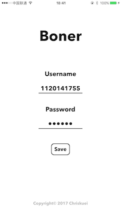
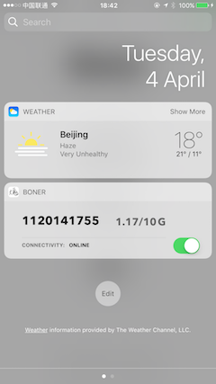

# Boner:

> Elegant network client for [BIT](http://www.bit.edu.cn)

## Screenshots

## Features

- [x] Login & Logout
- [x] Used data
- [x] User balance
- [x] Today Extension

## Requirements

- Swift 3.1+
- Xcode 8.3+
- macOS 10.12.4+

## FAQ

### What's the origin of the name Boner?

Boner is derived from [Bon](https://github.com/Chriskuei/Bon).

---

## Acknowledgements

- [Alamofire](https://github.com/Alamofire/Alamofire)

## Contribution

- If you need help or you'd like to ask a general question, open an issue.
- If you found a bug, open an issue.
- If you have a feature request, open an issue.
- If you want to contribute, submit a pull request.

## Credits

Bon is owned and maintained by [Chriskuei](http://github.com/chriskuei). You can follow him on Weibo at [@我叫陈陈陈大鬼](https://weibo.com/chenjiangui) for project updates and releases.

## License

Bon is released under the MIT license. See [LICENSE](LICENSE) for details.
